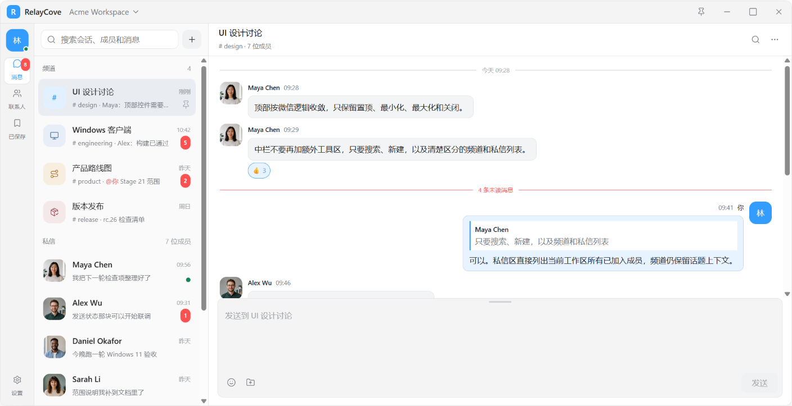
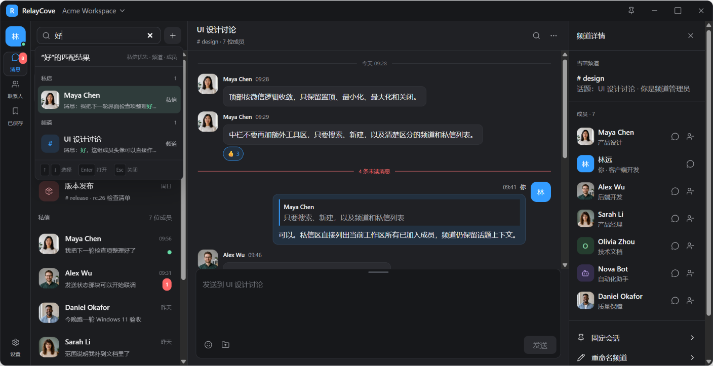

# RelayCove Chat UI v1 冻结清单

- 状态：Frozen
- 冻结日期：2026-08-12
- 基线 ID：`chat-ui-v1`

本目录是用户确认后的聊天主界面 Web UI 基线。它冻结的是视觉结构和交互意图，不是 MAUI 完成证据，也不扩大 Stage 21 的功能范围。

## 文件

| 文件 | 用途 | SHA-256 |
|---|---|---|
| `RelayCove-UI-Playground.html` | 可交互的独立 Web 原型 | `6C97FD26773F4D83A8DB76FFE2A61A6D0BFF9947AAD9E4533AD8B7DE3810507E` |
| `screenshots/desktop-light.png` | 1440×900 浏览器视口下的浅色应用区域，PNG 1408×723 | `E0C602E2BA69E9C1B4499E020A941B074E077B0B119826530B6394C962E1477F` |
| `screenshots/desktop-dark-search-details.png` | 1440×900 浏览器视口下的深色搜索/详情应用区域，PNG 1408×723 | `CE19972FBAAB3F09A4F5284E0EFBCF7AE62855484C5464C4603F559E600559C3` |
| `screenshots/desktop-1024-light.png` | 1024×768 浏览器视口下的浅色应用区域，PNG 977×722 | `9D380EA9FD2E4421E32F12D192DB9AA2994A1D46BF7352E9A2EDCC2EE9A9FC48` |

`SHA256SUMS.txt` 提供相同信息的机器可读清单。

## 冻结内容

- 微信式顶部窗口控制：置顶、最小化、最大化、关闭。
- 左侧用户与消息、联系人、已保存、设置导航。
- 中栏仅保留全局搜索、新建按钮，以及明确分组的频道和私信列表。
- 消息区、引用、反应、图片预览、未读分割线和发送状态展示。
- 底部多行输入区，仅保留表情、上传和发送；顶部拖柄可在 72–300 px 间调整高度。
- 可折叠右侧成员/会话详情及频道权限入口。
- 搜索支持部分匹配和单数字；消息索引只包含真实正文和附件名，不包含时间、日期或未读分割文案。
- 会话未读红点由同一状态模型汇总，打开会话时原型会同步刷新主导航总数。

## 回归证据

使用真实 Chromium 在本机执行了以下检查：

- `09:12` 不命中任何结果，证明消息时间未进入索引。
- `relaycove-team` 命中 `附件：relaycove-team-avatars.jpg`。
- 选择未读为 5、2、1 的会话后，主导航总数依次从 8 变为 3、1、0。
- 输入区默认 112 px；键盘三次 `ArrowUp` 后为 160 px；指针向上拖动后为 182 px。
- 发送提交后输入区立即清空；发送中切出/切回并输入新草稿，成功后旧消息只出现一次且新草稿保留。
- 在 1440×900 和 1024×768 浏览器视口完成布局检查，并分别截取上表所列实际像素尺寸的应用区域。
- 浏览器控制台：0 errors、0 warnings。

## 使用限制

- HTML 为设计审查产物，会从固定 CDN 加载图标脚本；视觉交付同时由本目录 PNG 保底。
- 原型数据、头像、工作区和操作结果均为演示数据，不允许作为测试账号或 Zulip 配置。
- 原型里的“删除频道”等动作只改变演示状态。生产实现必须先验证 Zulip 12.1 API 与服务器 capability，并接受 403/权限变化。
- 原型打开会话时立即清除演示红点；生产 MAUI 只能根据 `IClientSession` 发布的已确认未读状态刷新。
- 冻结原型的私信列表没有单独放置群组私信样例行，`+` 菜单只有入口演示；这不是产品范围排除。原生转换必须按交互规格覆盖 1:1、群组和 self-DM。
- 成员列表、共同频道、已保存、presence 和频道 capability 是演示数据；22A 在没有真实契约时必须隐藏或标为不可用。
- 后续变更不得覆盖本目录；应创建新基线目录并记录新 hash。
